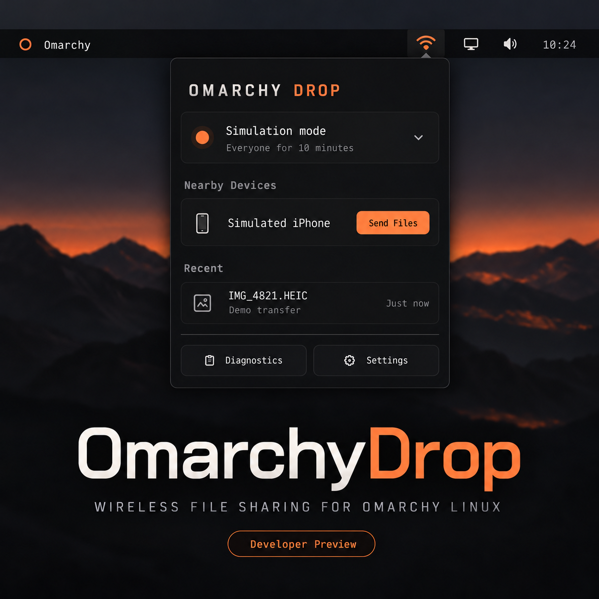

# OmarchyDrop

OmarchyDrop is a native Omarchy top-bar project for AirDrop-compatible file sharing. Its architecture is designed for both directions, honest hardware detection, a supported USB-radio fallback, an unprivileged Rust daemon, and a minimal future radio service.



> Current status: **post-0.1.0 developer preview**, not yet a validated interoperable release. A pinned real AWDL/AirDrop engine, guarded root radio service, adapter restoration, discovery, and multi-file send path are connected. The protected incoming-approval/streaming path and physical validation on each hardware family are still required before this can be called production-ready.

OmarchyDrop is independent open-source software. It is not affiliated with or endorsed by Apple. AirDrop is a trademark of Apple Inc.

## What works now

- Current Omarchy schema-version-1 `bar-widget` manifest and native `qs.Ui.Panel` popup.
- One persistent `omdropctl events --jsonl` status stream; no polling process loop and no second Quickshell instance.
- Versioned, mode-0600 Unix-socket IPC between the QML UI, CLI, and unprivileged daemon.
- Explicit application and transfer state models.
- Bounded Everyone-mode receive leases with automatic expiry.
- Passive Linux Wi-Fi/Bluetooth enumeration and conservative driver classification.
- `omdropctl status`, `events`, `peers`, `adapters`, `hardware probe`, `hardware test`, `diagnostics`, `receive`, and `recover` command surfaces.
- Exact-commit GPLv3 `filin`/`luftlift` engine packaging with a non-disruptive adapter preflight and explicit provenance.
- Real `_airdrop._tcp` discovery and multi-file `/Discover` → `/Ask` → `/Upload` sending over `awdl0`.
- A narrow polkit/systemd radio boundary that journals and restores interface type, link state, and NetworkManager ownership.
- Simulated AWDL backend, TSFT/monotonic timing, timestamp wraparound, and availability-window tests.
- Bounded BLE wake payload model based on verified BlueZ D-Bus measurements.
- Safe filename, size/count limit, URL-scheme, and collision-free destination utilities.
- Hardened per-user systemd service and Arch `PKGBUILD` for the unprivileged backend.

## Architecture

```text
Omarchy Quickshell panel
        │ JSONL + local actions
        ▼
omdropd (user daemon)
        ├── AirDrop application protocol
        ├── BLE wake coordinator
        └── hardware/session manager
                    │ narrow authenticated API
                    ▼
             radio service
                    │
              AWDL / awdl0
                    │
             iPhone or Mac
```

See [Architecture](docs/ARCHITECTURE.md), [research](docs/RESEARCH.md), [protocol](docs/PROTOCOL.md), [security](docs/SECURITY.md), and [licensing](docs/LICENSING.md).

## Development setup

Install a stable Rust toolchain with `rustfmt` and `clippy`, then:

```bash
cd backend
cargo build --workspace
cargo fmt --all -- --check
cargo clippy --workspace --all-targets --all-features -- -D warnings
cargo test --workspace --locked
```

Run the daemon and inspect this machine:

```bash
backend/target/debug/omdropd
backend/target/debug/omdropctl status
backend/target/debug/omdropctl adapters
backend/target/debug/omdropctl diagnostics --json
```

For UI development without radio hardware, run `omdropd --mock-hardware`. The simulated device is visibly marked as simulation and never upgrades real hardware support.

On a current Omarchy checkout, validate the plugin root with:

```bash
omarchy plugin validate .
```

Do not create a separate Git worktree for cloud tasks; use the checkout already provided under `/workspace`.

## Installation model

Install the QML plugin with:

```bash
omarchy plugin add https://github.com/akitwra/omadropshare.git --enable
```

That operation installs only the QML plugin. Install the native backend from the checked-out, exact plugin commit with:

```bash
~/.config/omarchy/plugins/io.github.akitwra.omarchy-drop/install.sh
```

The installer uses the Arch package recipe in an isolated temporary directory, installs any declared build dependencies through `makepkg`, enables the per-user service, and verifies that `omdropctl` can reach it. It pins the package build to the commit already reviewed and cloned by `omarchy plugin add`; it does not build a later moving branch tip.

The package intentionally disables makepkg's cross-language LTO injection.
Omarchy links Rust binaries with `lld`, which cannot consume the GCC LTO
objects emitted for native dependencies such as `ring`; Cargo's normal release
optimizations remain enabled.

The long-running daemon and CLI remain unprivileged. The user unit runs as the
logged-in user, sets `NoNewPrivileges=yes`, restricts its address families and
kernel access, and receives no Linux capabilities. Radio setup is isolated in a
short-lived root helper launched through a template system unit and an
authentication-required polkit action. No kernel patch, DKMS module, persistent
NetworkManager override, or passwordless privilege-escalation policy is
installed.

### Removal

Remove the backend package and service first, then remove the QML plugin:

```bash
~/.config/omarchy/plugins/io.github.akitwra.omarchy-drop/uninstall.sh
omarchy plugin remove io.github.akitwra.omarchy-drop
```

OmarchyDrop does not install kernel modules or persistent NetworkManager overrides. While a userspace AWDL session owns an adapter it temporarily releases that interface from NetworkManager and changes it to monitor mode. Stopping the radio service restores the journaled interface type, link state, and NetworkManager ownership; uninstall stops active radio units before removing the helper.

## CLI

Run `omdropctl adapters` first. In the active hardware-test example, replace `wlan1` with an adapter name reported on your machine; do not assume that interface exists.

```bash
omdropctl status
omdropctl status --json
omdropctl events --jsonl
omdropctl peers --json
omdropctl adapters
omdropctl hardware probe
omdropctl hardware test --adapter wlan1
omdropctl radio start --adapter wlan1
omdropctl discover --timeout 15
omdropctl send --peer 'receiver._airdrop._tcp.local.' ~/Pictures/photo.jpg
omdropctl radio status
omdropctl radio stop --adapter wlan1
omdropctl receive on --seconds 600
omdropctl receive off
omdropctl diagnostics --json
omdropctl recover
```

`hardware test` runs a non-disruptive monitor-mode preflight; it deliberately does not claim that frame injection works. `radio start` temporarily takes ownership of the chosen adapter and can interrupt normal Wi-Fi on that same radio. Prefer a dedicated USB adapter. Always run `radio stop` after testing; systemd also runs restoration after a crash or failed start.

Discovery and sending now use the real AirDrop protocol engine. Sending is restricted to exact IDs returned by discovery, regular files, 64 files per transfer, and 512 MiB total until the sender becomes fully streaming. Incoming receiving is still refused at the protocol boundary: the upstream standalone receiver auto-accepts and buffers uploads, which does not meet this project's approval and resource-safety requirements.

## Hardware policy

OmarchyDrop never equates monitor mode with working AWDL. A device remains `Candidate` until action-frame injection, data-frame injection, timing, channel control, cleanup, and real Apple-device transfers pass. See [the hardware matrix](docs/HARDWARE.md).

The intended fallback is a dedicated validated USB adapter: normal Internet remains on the internal radio while AWDL uses USB. MediaTek, Intel, Broadcom, and Realtek strategies remain separate and capability-driven.

## Sending and receiving roadmap

The UI and daemon are designed for incoming approval, progress, cancellation, history, peer expiry, multi-file sends, portal file picking, notifications, and bounded BLE wake. Real usability requires the remaining protocol/radio milestones and physical tests listed in [PROTOCOL.md](docs/PROTOCOL.md). Contacts Only is outside the first release; the project never asks for an Apple ID password.

## Privacy

There is no telemetry. Nearby-device state is ephemeral, diagnostics redact identity-bearing values by default, BLE wake is bounded, and received URLs are never opened automatically. Packet capture is absent and will remain opt-in and duration-limited if added.

## License

GPL-3.0-only. The project deliberately follows a GPL-compatible derivative strategy for OWL/OpenDrop research; see [LICENSING.md](docs/LICENSING.md) for provenance and the separate GPL-2.0-only native Broadcom boundary.

